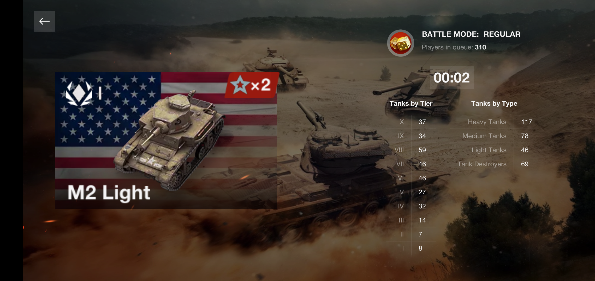
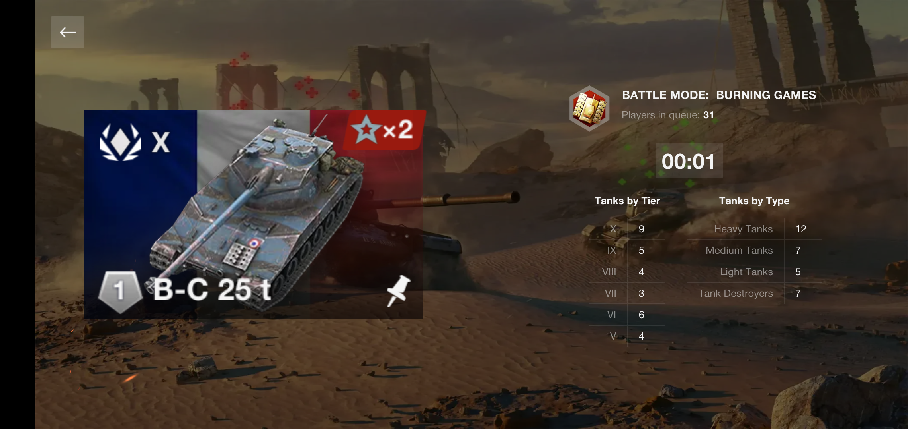

# WoT Blitz - Prebattle RandomQueue Remake mod




## Description
* [en](public/desc/en.txt)
* [ru](public/desc/ru.txt)

## Install
### Manual install
1. Download the `.zip` file from **Releases** section
2. Unpack chosen `.zip` file to `~res:/`

`~res:/` is the gamedata root:
- Android: `/your_sdcard/Android/data`
- Steam: `\Path\To\Steam\steamapps\common\World of Tanks Blitz`
- Windows Store: `...`

### Build from source

Dependencies
- [`dvpl` converter](https://github.com/Maddoxkkm/dvpl_converter)
- `make`
- `7z`
- `curl` (fow autodownloading background image assets from WG CDN)
- `magick` (for autoconverting assets to appropriate format )
- `coreutils` (or any other POSIX-compliant util sets)

```sh
make [WMOD_TARGETPLATFORM=(android|pc)] [WMOD_TARGETPUBLISHER=(wg|lg|any)]
```

See [Makefile](Makefile) for details.

### Install
```sh
make [WMOD_TARGETPLATFORM=...] [WMOD_TARGETPUBLISHER=...]
make [WMOD_TARGETPLATFORM=...] [WMOD_TARGETPUBLISHER=...] WMOD_INSTALLDIR=<your_path_to_game> install
```
### Deploy .zip package
```sh
make [WMOD_TARGETPLATFORM=...] [WMOD_TARGETPUBLISHER=...] package
```
